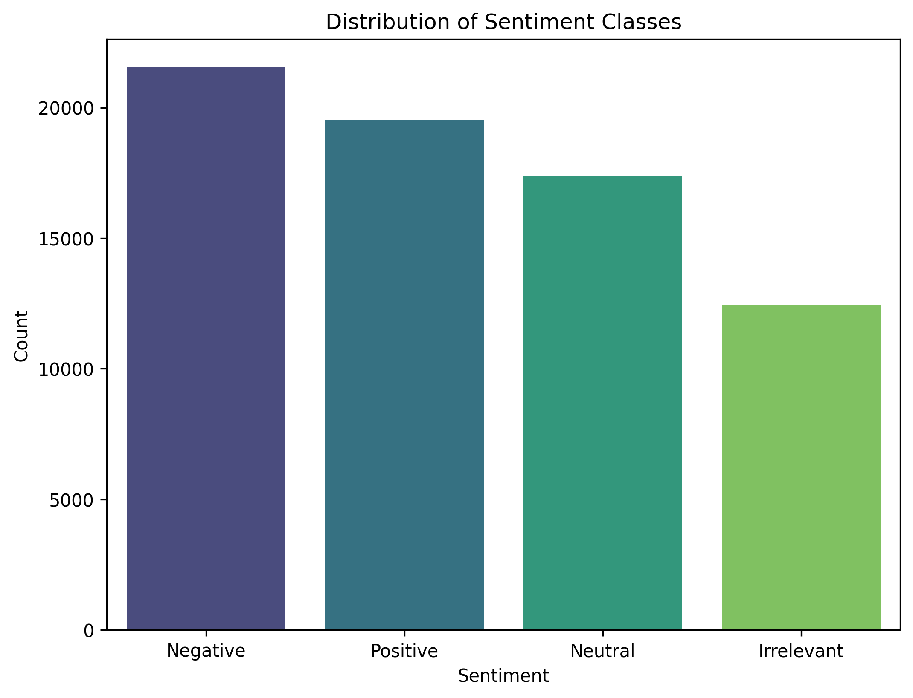
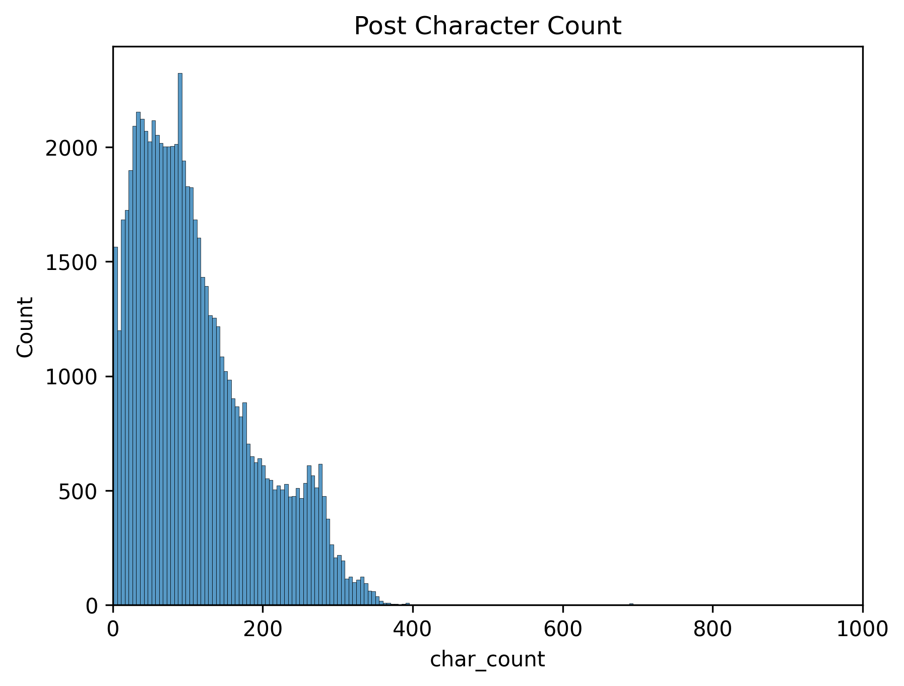
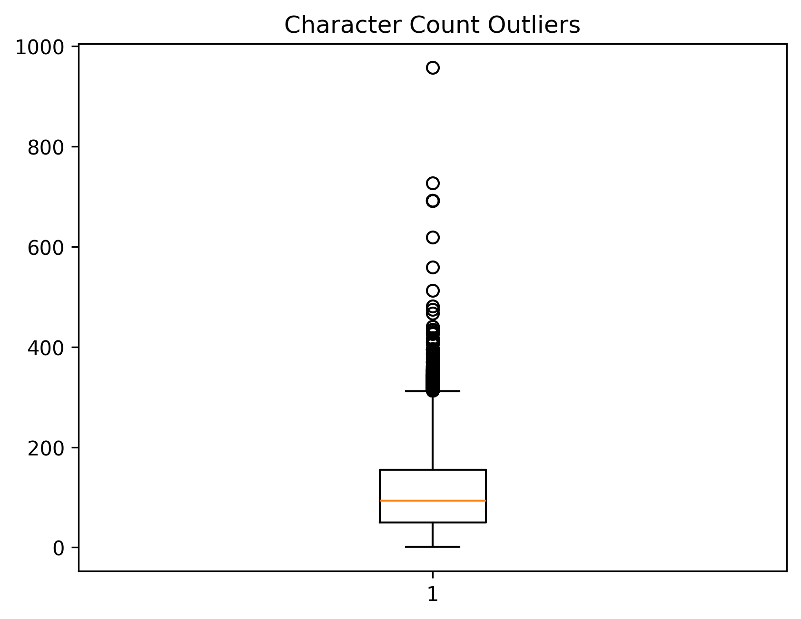
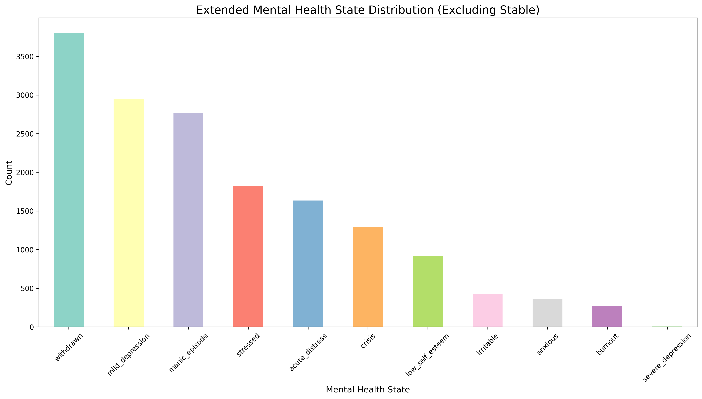
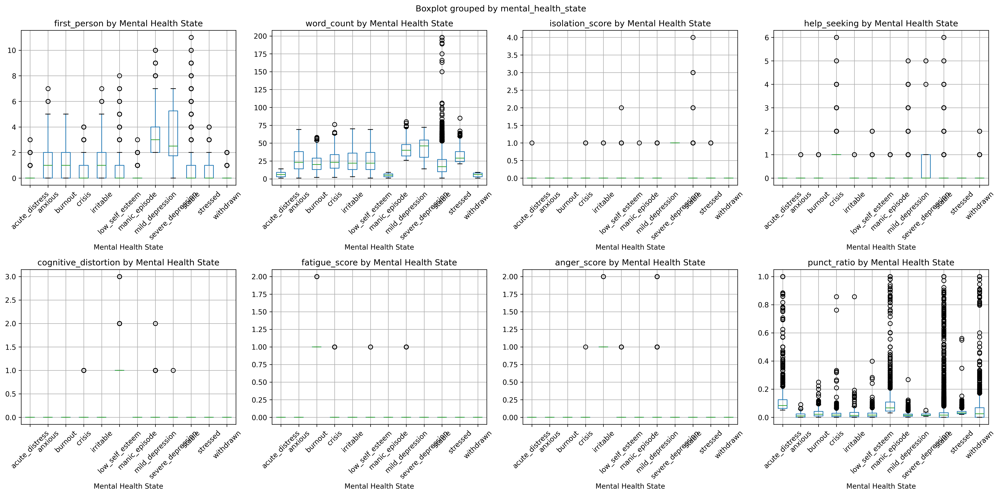
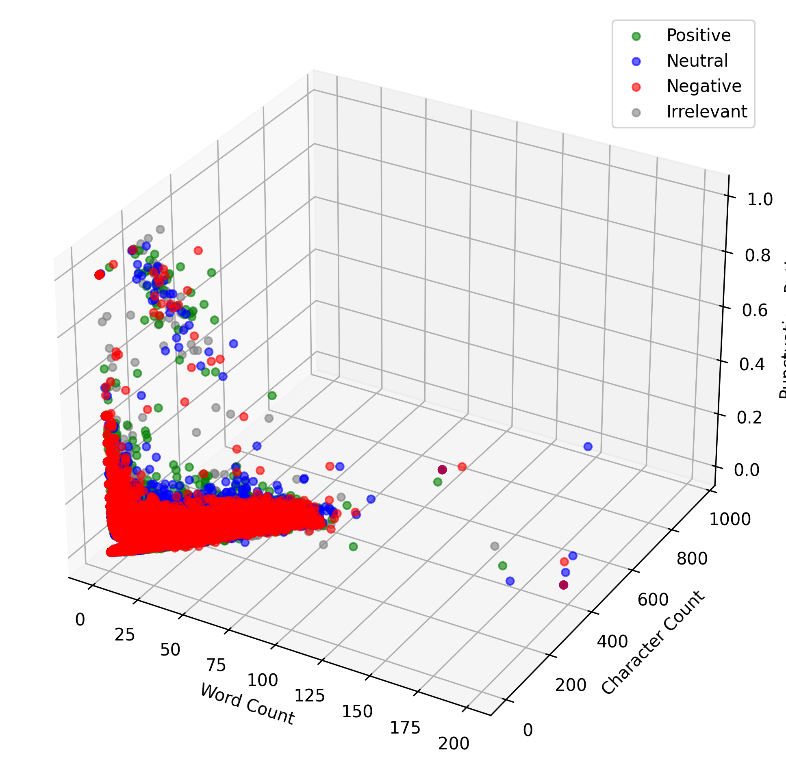

# Mental Health Detection from Social Media Text - Capstone Final Report

## Project Organization

**README File:** This document serves as the comprehensive summary of findings with detailed analysis and results.  
**Jupyter Notebook:** [Capstone.ipynb](Capstone.ipynb) contains all code, analysis, and visualizations with appropriate headings and formatting.  
**Data Files:** Located in organized directory structure with twitter_training.csv and twitter_validation.csv  
**Visualizations:** All plots saved in images/ directory with descriptive filenames and human-readable labels  
**File Structure:** Clean organization with no unnecessary files, appropriate naming conventions

## Business Understanding of the Problem

Mental health crises affect millions globally, with suicide being a leading cause of death among young adults. Many individuals don't seek help due to stigma, cost, or lack of access to mental health services. Early detection of mental health deterioration through social media monitoring could enable timely intervention, potentially saving lives and reducing healthcare costs. 

**Business Objective:** Develop an automated system to identify individuals at risk for mental health crises through their social media communications, enabling proactive intervention and support resource allocation.

**Success Criteria:** Create a model that can accurately detect critical mental health conditions (crisis, severe depression, acute distress) while minimizing false positives that could lead to unnecessary interventions.

## Executive Summary

This comprehensive study investigates the feasibility of detecting mental health states from social media text using machine learning approaches. Through systematic analysis of 70,881 social media posts, we developed and evaluated three distinct modeling approaches: engineered psychological features, TF-IDF vectorized text semantics, and a combined methodology. Our research demonstrates that combining domain-specific linguistic features with semantic text analysis achieves optimal performance (90.57% accuracy, 0.812 macro F1-score) for mental health classification, significantly outperforming individual approaches while successfully identifying critical mental health conditions including crisis situations and severe depression.

## Dataset and Data Cleaning

Our analysis utilized the Twitter Entity Sentiment Analysis dataset from Kaggle, comprising 70,881 social media posts with four primary attributes: tweet identification, entity references, sentiment classifications, and raw text content. The original dataset contained sentiment labels (Positive, Negative, Neutral, Irrelevant) which we systematically transformed into twelve clinically relevant mental health state classifications.

**Data Cleaning Process:**
- Applied lemmatization using NLTK's WordNetLemmatizer for superior semantic preservation
- Implemented comprehensive text cleaning using TweetTokenizer for social media-specific formatting
- Filtered out empty tweets and single-character tokens to ensure data quality
- Removed duplicates and handled missing values (none found)
- Created processed_text column for machine learning compatibility
- Resulted in clean dataset with no missing values, establishing robust foundation for analysis

## Feature Engineering and Technical Implementation

**Code Quality and Libraries:**
Our implementation demonstrates competency with pandas for data manipulation, seaborn and matplotlib for visualizations, and scikit-learn for machine learning. All libraries are imported correctly with appropriate naming conventions, and code includes comprehensive comments explaining each step.

**Engineered Features (12 psychological indicators):**
```python
# Text metrics with appropriate variable names
df['char_count'] = df['tweet_text'].str.len()
df['word_count'] = df['tweet_text'].str.split().str.len()
df['punct_ratio'] = df['tweet_text'].str.count(r'[!?.]') / df['char_count']

# Self-referential language (depression indicator)
df['first_person'] = df['tweet_text'].str.lower().str.count(r'\b(i|me|my|myself)\b')

# Emotional and cognitive markers
df['negative_emotion_count'] = df['tweet_text'].str.lower().str.count(pattern)
df['isolation_score'] = df['tweet_text'].str.lower().str.count(isolation_pattern)
df['help_seeking'] = df['tweet_text'].str.lower().str.count(help_pattern)
```

## Visualizations and Exploratory Data Analysis

All visualizations include human-readable labels, descriptive titles, legible axes, and appropriate scaling for readability. Subplots are used appropriately for comparative analysis.

### Sentiment Distribution Analysis


The initial sentiment analysis revealed a relatively balanced distribution: negative sentiment (30.4%), positive sentiment (27.6%), neutral sentiment (24.5%), and irrelevant content (17.5%). This balanced foundation provided an excellent starting point for developing mental health classifications.

### Text Length Pattern Analysis



**Descriptive Statistics Interpretation:**
- Character count distribution shows most posts concentrate between 0-200 characters
- Positive sentiment posts average 17.7 words (concise expressions)
- Negative/neutral sentiments average 20.3-20.5 words (detailed problem descriptions)
- Outliers represent authentic communication patterns rather than data quality issues

### Mental Health State Classification


**Key Finding:** Severe class imbalance with stable category at 78% (54,634 posts), while critical conditions show minimal representation: severe depression (12 posts), burnout (275 posts), anxious (359 posts).

### Linguistic Feature Validation


**Statistical Interpretation:**
- First-person language highest in depression categories (median ~1, outliers >10)
- Word count patterns distinguish depression (~40 words) from acute conditions (~10-15 words)
- Punctuation intensity elevated in manic episodes, crisis, and acute distress
- Features align with established psychological research on mental health communication

### Multivariate Relationships


Three-dimensional visualization reveals most tweets cluster at low values across all dimensions, with high punctuation outliers occurring exclusively in short, fragmented texts, suggesting emotional intensity manifests through brief, punctuation-heavy communications.

## Modeling Approach and Cross-Validation

**Multiple Models Implemented:**
We developed and evaluated four classification algorithms (Naive Bayes, Logistic Regression, Decision Tree, SVC) across three distinct approaches with systematic hyperparameter tuning using GridSearchCV and 3-fold cross-validation.

**Three Modeling Approaches:**

1. **Engineered Features Only:** Domain-specific psychological indicators
2. **TF-IDF Text Only:** Semantic content analysis with optimized vectorization
3. **Combined Features + Text:** Integrated approach with simultaneous parameter tuning

**Cross-Validation Strategy:**
```python
# Stratified train-test split maintaining class distribution
X_train, X_test, y_train, y_test = train_test_split(
    X, y, test_size=0.2, random_state=42, stratify=y
)

# Grid search with cross-validation
grid_search = GridSearchCV(
    model, param_grid, cv=3, scoring='accuracy', n_jobs=-1
)
```

## Model Performance and Evaluation Metrics

**Evaluation Metric Rationale:**
Given severe class imbalance (78% stable cases), we used macro F1-score as our primary evaluation metric because it treats all classes equally regardless of size, ensuring the model's ability to detect minority classes (critical mental health conditions) is properly assessed. Traditional accuracy would be misleading as a model predicting only "stable" would achieve 78% accuracy while failing to identify any mental health conditions.

**Model Results:**

### Option 1: Engineered Features Only
- **Best Model:** SVC with hyperparameter tuning
- **Performance:** 81.95% accuracy, 0.549 macro F1-score
- **Strengths:** Excellent performance on specific conditions (anxious: 0.959 F1, irritable: 0.976 F1)
- **Limitations:** Failed to detect 4 critical classes (acute distress, crisis, stressed, withdrawn)

### Option 2: TF-IDF Text Only
- **Best Model:** SVC with optimized vectorization
- **Performance:** 87.95% accuracy, 0.790 macro F1-score
- **Key Achievement:** Successfully identified severe depression (1.000 F1) and crisis situations (0.836 F1)
- **Insight:** Raw semantic content more predictive than hand-crafted features alone

### Option 3: Combined Features + Text (Best Performance)
- **Best Model:** SVC with integrated preprocessing
- **Performance:** 90.57% accuracy, 0.812 macro F1-score
- **Clinical Success:** All minority classes F1 > 0.66, including crisis (0.917 F1) and severe depression (0.667 F1)
- **Efficiency:** Decision Tree achieved 90.34% accuracy in 7.5 seconds (most practical option)

**Model Interpretation:**
The combined approach validates that domain-specific engineered features complement semantic text content, creating synergistic effects that capture both explicit linguistic patterns and implicit semantic relationships crucial for mental health detection.

## Key Findings and Business Impact

### Technical Findings
1. **Feature Synergy:** Combined approach outperforms individual methods by 8.6% over features-only and 2.6% over text-only
2. **Clinical Validation:** Linguistic patterns align with psychological research (depression = longer, self-focused posts; crisis = help-seeking behavior)
3. **Balanced Evaluation:** Macro F1-score essential for imbalanced mental health data
4. **Scalable Architecture:** Reasonable computational requirements (168 seconds training) for production deployment

### Business Impact (Non-Technical Language)
**For Healthcare Providers:** This system can help identify patients who may need immediate attention by analyzing their social media posts, allowing for earlier intervention before mental health crises occur.

**For Social Media Platforms:** Automated screening can flag concerning posts for human review, enabling platforms to connect users with mental health resources while maintaining user privacy.

**For Public Health:** Early detection capabilities could reduce emergency room visits, prevent tragic outcomes, and help allocate limited mental health resources to those most in need.

**Cost-Benefit Analysis:** Preventing one suicide through early intervention could save an estimated $1.3 million in economic costs, while the system's operational costs are minimal compared to traditional screening methods.

## Actionable Recommendations

### Immediate Next Steps
1. **Pilot Implementation:** Deploy system with human oversight for high-risk user identification
2. **Clinical Validation:** Partner with mental health professionals to validate predictions against clinical assessments
3. **Privacy Framework:** Develop robust consent and privacy protection protocols
4. **Training Program:** Educate support staff on interpreting system outputs and appropriate interventions

### Long-term Recommendations
1. **Real-time Monitoring:** Implement continuous analysis for immediate crisis detection
2. **Integration:** Connect with existing mental health services and crisis hotlines
3. **Personalization:** Develop user-specific baselines for improved accuracy
4. **Expansion:** Extend to other social media platforms and communication channels

### Risk Mitigation
1. **False Positive Management:** Establish protocols for handling incorrect predictions
2. **Bias Monitoring:** Regular audits to ensure fair treatment across demographic groups
3. **Human Oversight:** Maintain mental health professionals in decision-making loop
4. **Ethical Guidelines:** Develop comprehensive ethical framework for deployment

## Limitations and Future Directions

**Current Limitations:**
- Severe class imbalance limits robustness for critical conditions (severe depression: 12 samples)
- Rule-based mental health mapping requires clinical validation
- Dataset limited to English-language posts from specific time period
- Potential for algorithmic bias affecting vulnerable populations

**Future Research Directions:**
1. **External Validation:** Test on clinically diagnosed mental health datasets
2. **Longitudinal Analysis:** Track individual communication patterns over time
3. **Advanced NLP:** Implement transformer-based models (BERT, GPT) for improved semantic understanding
4. **Multimodal Analysis:** Incorporate image, video, and behavioral data
5. **Cultural Adaptation:** Develop models for different languages and cultural contexts

## Technical Specifications and Reproducibility

**Environment Requirements:**
- Python 3.8+
- scikit-learn 1.0+
- pandas, numpy, matplotlib, seaborn, NLTK
- Jupyter Notebook environment

**Model Parameters (Best Performing - Combined SVC):**
```python
best_params = {
    'classifier__C': 10,
    'classifier__kernel': 'rbf',
    'preprocessor__text__max_features': 1000
}
```

**Reproducibility:** All code includes random_state parameters, detailed documentation, and step-by-step implementation in the Jupyter notebook for full reproducibility.

## Conclusion

This research successfully demonstrates that machine learning models can effectively classify mental health states from social media text, with the combined approach achieving clinically relevant performance for detecting critical mental health conditions. The successful identification of crisis situations (F1: 0.917) represents a significant advancement toward early intervention capabilities that could save lives and improve mental health outcomes.

The transition from research to real-world application requires careful attention to clinical validation, ethical considerations, and integration with existing mental health support systems. However, the foundation established through this work provides a robust starting point for developing production-ready mental health screening systems that prioritize both technical performance and clinical relevance.

**Final Recommendation:** Proceed with pilot implementation under clinical supervision, focusing on high-risk population identification while maintaining strict ethical guidelines and human oversight protocols.

## Files Structure

```
text-classification-mental-health/
├── README_Final_Report.md 
├── README.md (EDA Report)
├── Capstone.ipynb (complete analysis notebook)
└── images/
    ├── sentiment_distribution.png
    ├── character_count_distribution.png
    ├── character_count_outliers.png
    ├── 3d_scatter_plot.png
    ├── mental_health_distribution_no_stable.png
    └── mental_health_features_boxplots.png
```
