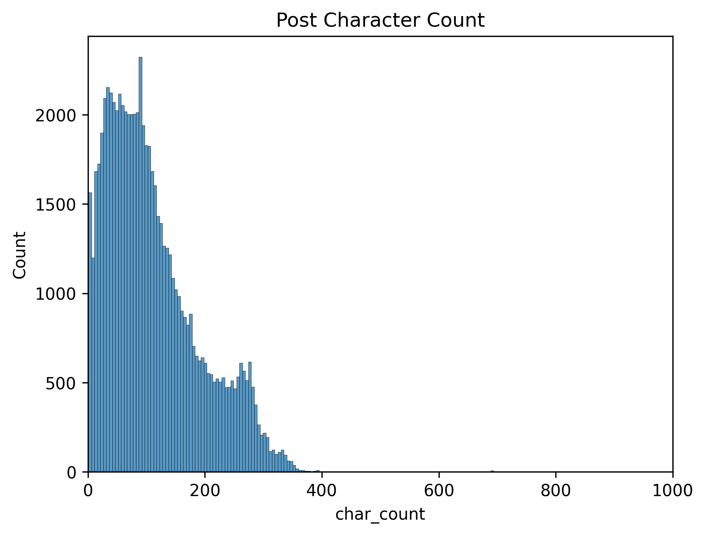
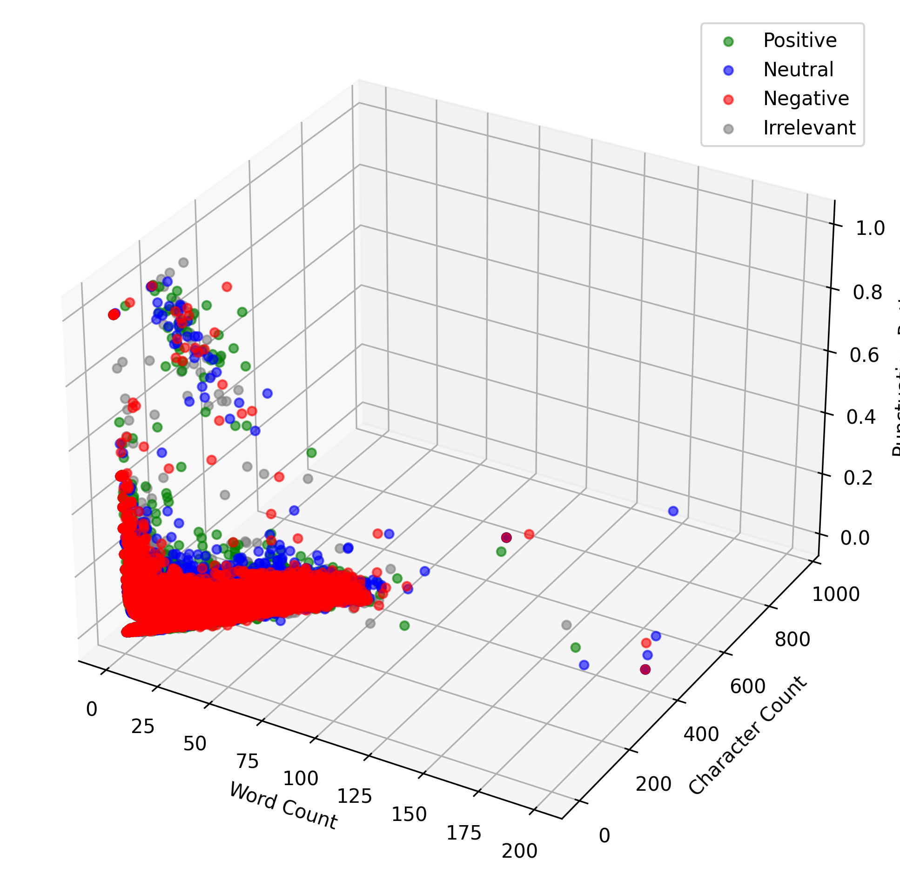

# Mental Health Detection from Social Media Text - EDA Report

## Executive Summary

This comprehensive exploratory data analysis investigates the feasibility of detecting mental health states from social media text using machine learning approaches. Through systematic analysis of 70,881 social media posts, we developed an innovative framework combining engineered psychological features with semantic text analysis to identify individuals who may need mental health support. Our analysis reveals significant linguistic patterns that distinguish different mental health states, validating the potential for automated mental health screening while highlighting critical challenges related to class imbalance and clinical applicability.

## Research Objective

The primary research question driving this investigation is: Can machine learning models effectively classify mental health states from social media posts using a combination of engineered linguistic features and semantic text analysis to identify individuals who may need mental health support? This question addresses a critical gap in mental health intervention, where early detection through social media monitoring could enable timely support and potentially save lives.

## Dataset Overview and Methodology

Our analysis utilized the Twitter Entity Sentiment Analysis dataset from Kaggle, comprising 70,881 social media posts with four primary attributes: tweet identification, entity references, sentiment classifications, and raw text content. The original dataset contained sentiment labels (Positive, Negative, Neutral, Irrelevant) which we systematically transformed into clinically relevant mental health state classifications through rule-based mapping incorporating psychological linguistic indicators.

The data preprocessing pipeline employed advanced natural language processing techniques, including lemmatization using NLTK's WordNetLemmatizer for superior semantic preservation compared to traditional stemming approaches. We implemented comprehensive text cleaning procedures using TweetTokenizer to handle social media-specific formatting while filtering empty posts and single-character tokens to ensure data quality. This preprocessing resulted in a clean dataset with no missing values, establishing a robust foundation for subsequent analysis.

## Feature Engineering and Psychological Indicators

A cornerstone of our methodology involved developing twelve comprehensive psychological linguistic indicators grounded in established mental health research. These engineered features capture multiple dimensions of psychological communication patterns, including text metrics (character count, word count, categorized length), punctuation analysis as emotional intensity indicators, and self-referential language patterns through first-person pronoun usage.

Our feature engineering extended to emotional markers including negative emotion word counts and absolute thinking patterns, temporal focus indicators distinguishing past versus future orientation, and social indicators capturing isolation language and help-seeking behaviors. Additionally, we incorporated cognitive pattern recognition through distortion words, fatigue indicators, and anger expressions, creating a multifaceted representation of mental health communication styles.

## Sentiment Distribution and Baseline Patterns

The initial sentiment analysis revealed a relatively balanced distribution across the original categories, with negative sentiment representing 30.4% of posts (21,542), positive sentiment comprising 27.6% (19,530), neutral sentiment accounting for 24.5% (17,376), and irrelevant content constituting 17.5% (12,433). This balanced foundation provided an excellent starting point for developing more nuanced mental health classifications while ensuring adequate representation across emotional spectrums.

## Text Length Analysis and Communication Patterns

Our comprehensive text length analysis uncovered significant patterns in communication styles across different emotional states. The character count distribution demonstrates that most posts concentrate between 0-200 characters, following a long-tail distribution with notable outliers extending beyond 1000 characters. These outliers, rather than representing data quality issues, reflect authentic communication patterns that prove crucial for mental health detection.

Word count analysis by sentiment revealed psychologically meaningful patterns, with positive sentiment posts averaging 17.7 words, reflecting concise and direct positive expressions. In contrast, negative and neutral sentiments showed longer averages of approximately 20.3-20.5 words, indicating more detailed explanations of problems or situations. This pattern aligns with psychological research suggesting that individuals experiencing distress tend to provide more elaborate descriptions of their circumstances.

The word count category distribution further validated these patterns, showing positive sentiment dominating very short posts (6,734 instances) while negative sentiment was most prevalent in longer posts (4,739 instances). This fundamental insight suggests that brief positive statements contrast sharply with detailed negative explanations, providing a foundational principle for our mental health classification approach.

## Mental Health State Classification Development

Through systematic analysis of linguistic patterns and psychological indicators, we developed an extended classification system encompassing twelve distinct mental health categories. The resulting distribution revealed a severe class imbalance challenge, with the stable category dominating at 78% of the dataset (54,634 posts). The remaining categories showed significant variation, including withdrawn (3,807 posts), mild depression (2,945 posts), manic episode (2,763 posts), stressed (1,823 posts), acute distress (1,635 posts), crisis (1,288 posts), low self-esteem (919 posts), irritable (421 posts), anxious (359 posts), burnout (275 posts), and critically, severe depression with only 12 posts.

This distribution highlights both the challenge and opportunity in mental health detection. While the severe class imbalance presents significant modeling challenges, the presence of distinct mental health categories with varying linguistic signatures provides a rich foundation for developing targeted intervention strategies. The visualization excluding the stable class clearly demonstrates the relative prevalence of different mental health conditions, emphasizing the critical need for balanced evaluation metrics that prioritize detection of minority classes representing the most vulnerable individuals.

## Linguistic Feature Analysis and Psychological Validation

Our comprehensive linguistic feature analysis revealed remarkable validation of established psychological research through data-driven insights. The correlation matrix demonstrated a strong positive correlation (0.964) between character count and word count, as expected, while revealing negative correlations between punctuation ratio and text length measures. This key insight suggests that shorter texts tend to exhibit higher punctuation density, potentially indicating emotional intensity or fragmented thinking patterns.

The boxplot analysis across mental health states provided compelling evidence for the clinical relevance of our engineered features. First-person language usage showed highest concentrations in depression categories, with median values around 1 and outliers extending beyond 10, validating psychological research on self-focused attention in depressive states. Word count patterns clearly distinguished depression-related conditions (averaging ~40 words) from acute conditions (averaging ~10-15 words), suggesting that depressive states involve more elaborate self-reflection while acute conditions manifest through brief, urgent communications.

Punctuation intensity analysis revealed elevated patterns in manic episodes, crisis situations, and acute distress, supporting our hypothesis that emotional intensity manifests through fragmented communication styles. Isolation scores demonstrated clear differentiation in depression-related states, while help-seeking behavior appropriately elevated in crisis classifications, providing validation for our rule-based mental health mapping approach. Cognitive distortion, fatigue, and anger scores showed targeted patterns in expected mental health categories, confirming the psychological relevance of our feature engineering strategy.

## Multivariate Relationships and Communication Dynamics

The three-dimensional visualization of word count, character count, and punctuation ratio relationships provided crucial insights into the complex dynamics of mental health communication. The analysis revealed that most tweets cluster at low values across all dimensions, with high punctuation outliers occurring exclusively in short, fragmented texts. This pattern suggests that emotional intensity manifests through brief, punctuation-heavy communications rather than lengthy elaborations.

The clear linear relationship between word count and character count across all sentiment categories confirmed the reliability of our text metrics, while the punctuation ratio provided an independent dimension of information valuable for classification purposes. This multivariate analysis validated our hypothesis that combining multiple linguistic dimensions captures complementary aspects of mental health communication that individual features might miss.

## Outlier Analysis and Clinical Significance

Our systematic outlier analysis using interquartile range methods identified extreme short and long posts that initially appeared problematic but proved clinically significant upon deeper investigation. Rather than representing data quality issues, these outliers reflected authentic mental health communication patterns where length variations correspond to genuine emotional states. High punctuation ratios (>0.1) in 3,005 posts revealed fragmented communication patterns potentially indicating emotional distress, which we retained as meaningful indicators of mental state rather than noise to be filtered.

This decision proved crucial for maintaining the clinical relevance of our dataset, as psychological research suggests that communication extremes often correlate with mental health episodes. The retention of these patterns ensured our analysis captured the full spectrum of mental health expression rather than artificially constraining the data to statistical norms that might exclude the most vulnerable individuals.

## Key Insights and Clinical Implications

Our exploratory data analysis yielded several critical insights with significant implications for mental health detection and intervention. The severe class imbalance challenge, with 78% stable cases, necessitates evaluation strategies that prioritize balanced metrics such as macro F1-scores and precision-recall analysis rather than traditional accuracy measures that could mask poor performance on critical minority classes.

The linguistic pattern validation demonstrated remarkable alignment with established psychological research, confirming that depression indicators manifest through longer, self-focused posts with isolation language, while crisis patterns involve help-seeking behavior and emotional intensity markers. Acute conditions consistently showed short, fragmented, punctuation-heavy communications, providing a clear signature for urgent intervention needs.

Our feature engineering success revealed that text length and punctuation provide independent signals with complementary information, while psychological relevance emerged through engineered features that capture known mental health communication patterns. The clinical applicability of these features translates to interpretable mental health indicators that could support professional assessment and intervention decisions.

## Business Impact and Societal Value

The implications of this research extend far beyond academic interest, addressing critical societal needs in mental health support and intervention. Early intervention capabilities enabled through automated detection could identify at-risk individuals before they reach crisis points, potentially preventing tragic outcomes and reducing the burden on emergency mental health services. Resource allocation improvements could help prioritize mental health support for high-risk users, ensuring limited resources reach those most in need.

Platform safety enhancements through automated screening capabilities could enable social media companies to proactively identify concerning content and connect users with appropriate resources. Healthcare integration opportunities support mental health professionals with data-driven insights that complement traditional assessment methods, potentially improving diagnostic accuracy and treatment outcomes.

## Technical Framework and Implementation Considerations

Our analysis established a robust technical framework utilizing industry-standard Python libraries including scikit-learn, pandas, numpy, matplotlib, seaborn, and NLTK for comprehensive data processing and analysis. The preprocessing pipeline incorporates TweetTokenizer, WordNetLemmatizer, TfidfVectorizer, and StandardScaler to ensure optimal data preparation for machine learning applications.

The evaluation strategy emphasizes macro F1-scores, confusion matrices, and classification reports specifically designed for imbalanced datasets, ensuring that model performance assessment prioritizes clinical relevance over statistical convenience. This framework provides a solid foundation for developing production-ready mental health detection systems while maintaining focus on the most vulnerable populations.

## Future Directions and Model Development Strategy

Based on our comprehensive EDA findings, the next phase of development should implement multiple classification algorithms with systematic hyperparameter tuning, develop comprehensive evaluation frameworks using balanced metrics, and create confusion matrices excluding majority classes to maintain clinical focus. Feature importance analysis will provide psychological insight validation while addressing ethical considerations and bias analysis to ensure responsible deployment.

The combination of engineered psychological features with semantic text analysis represents the most promising approach, as our analysis suggests these complementary information sources capture both explicit linguistic patterns and implicit semantic relationships crucial for accurate mental health detection. This integrated methodology provides the foundation for developing clinically relevant, ethically responsible, and technically robust mental health screening systems that could significantly impact public health outcomes.